# Arquitectura DSP — Virtual Amp System

Este documento detalla el flujo de señal y los algoritmos utilizados en el motor de audio.

## Flujo de Señal (Signal Chain)

```mermaid
graph LR
    Input --> NoiseGate
    NoiseGate --> Overdrive
    Overdrive --> Preamp_Stage1
    Preamp_Stage1 --> Preamp_Stage2
    Preamp_Stage2 --> ToneStack
    ToneStack --> Preamp_Stage3
    Preamp_Stage3 --> Cabinet
    Cabinet --> GraphicEQ
    GraphicEQ --> Chorus
    Chorus --> Delay
    Delay --> MasterOutput
```

## Detalles Técnicos

### 1. Simulación de Válvulas (Pre-Amp)
Utilizamos tres etapas de `juce::dsp::WaveShaper`. La función de transferencia simula la saturación asimétrica de una válvula triodo:
- **Stage 1 (Input)**: Recorte suave para añadir armónicos pares.
- **Stage 2 (Gain)**: Saturación principal controlada por el parámetro GAIN.
- **Stage 3 (Power Amp)**: Compresión final antes de la salida.

### 2. Tone Stack (IIR Filters)
Implementado mediante filtros de Respuesta al Impulso Infinita (IIR):
- **Bass**: Low-shelf a 200Hz.
- **Mid**: Peak filter a 750Hz (típico "mid-scoop" americano).
- **Treble**: High-shelf a 3.5kHz.
- **Presence**: High-shelf a 6kHz que actúa en la etapa de potencia.

### 3. Tuner (Pitch Detection)
Utiliza el algoritmo **YIN**. El buffer de audio se procesa en bloques de 2048 muestras para calcular la función de diferencia acumulada, lo que permite una detección estable hasta en las cuerdas más graves de la guitarra.

### 4. Cabinet Simulation
Actualmente utiliza filtros de paso alto y paso bajo de segundo orden (Linkwitz-Riley) para simular la respuesta de frecuencia de un altavoz de 12". El motor está preparado para la implementación de `juce::dsp::Convolution` (IR).

---
*Referencia: Basado en topologías clásicas de amplificación de alta ganancia.*
